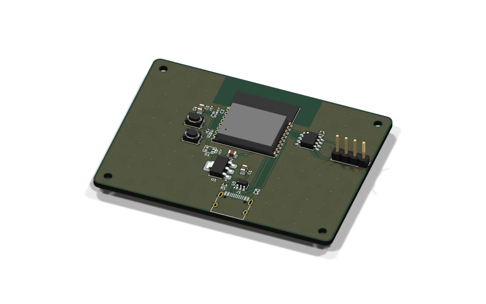
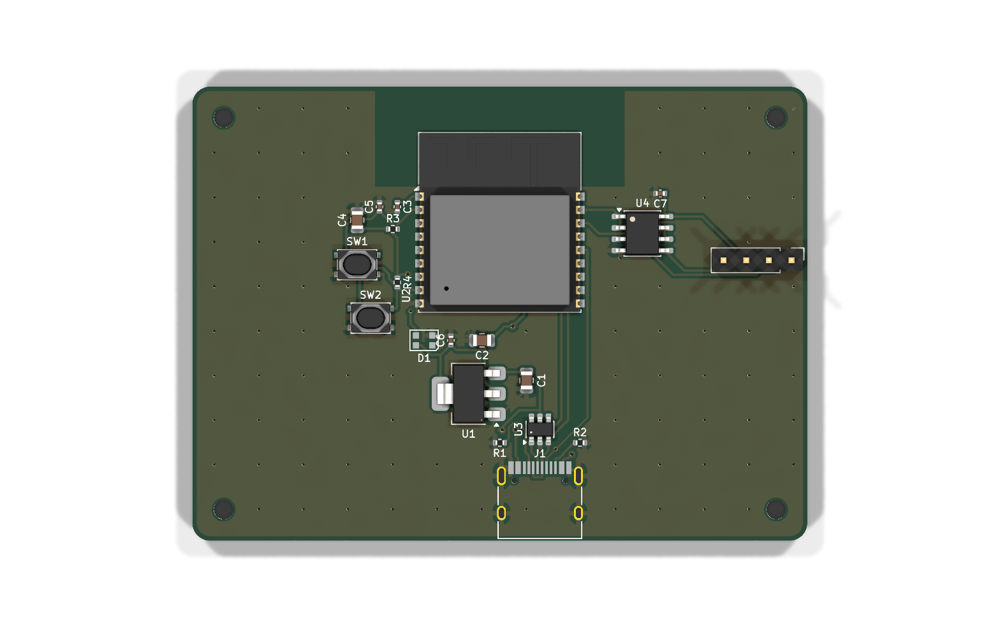
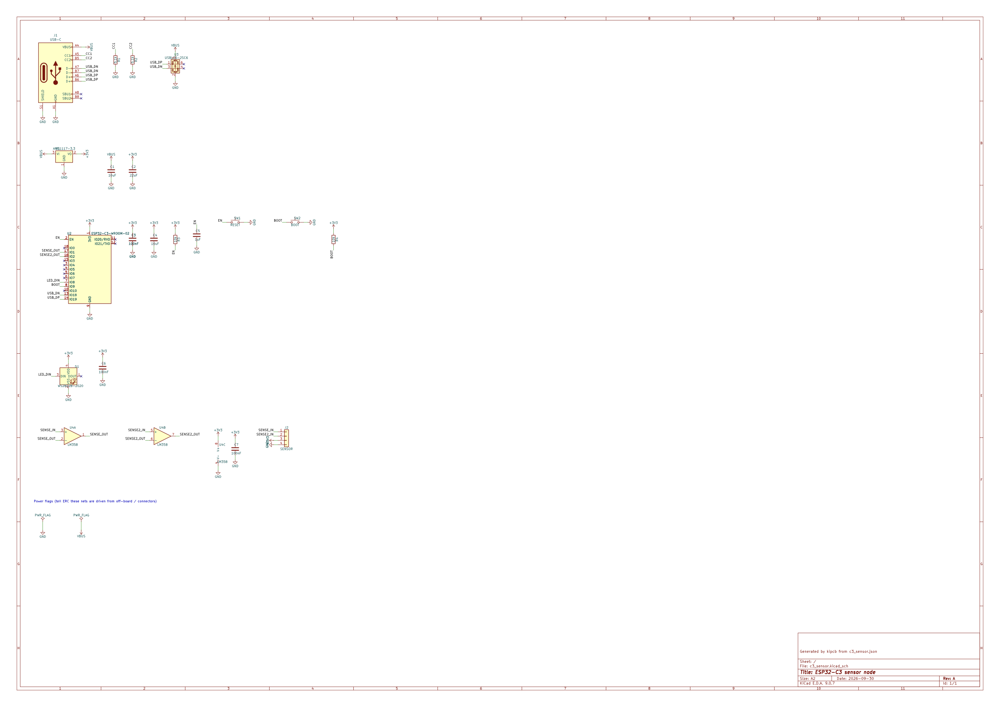
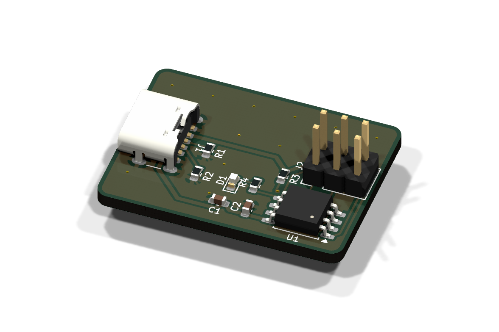
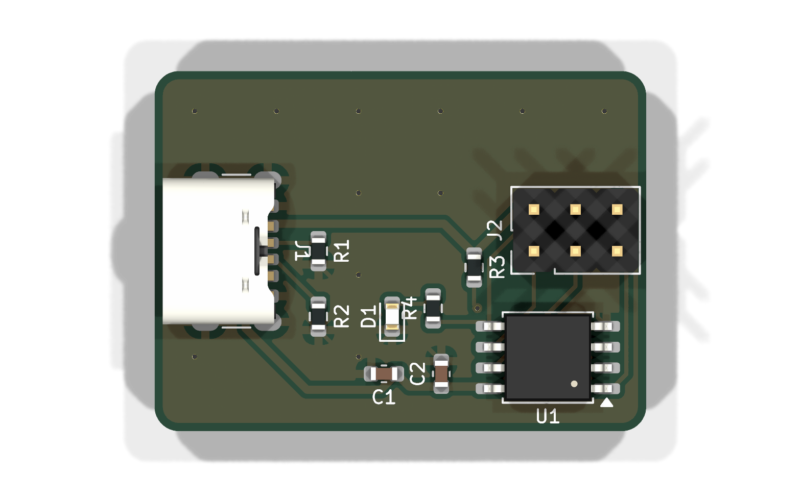

<div align="center">



# PCB Design for Claude Code

**Describe a circuit board in plain English. Get a manufacturable KiCad project.**

Requirements → parts → schematic → placement → autorouting → checks → Gerbers, BOM and pick-and-place,
<br>with Claude as your electrical engineer.

<a href="https://github.com/virajrungta/pcb-claude-plugin/releases"></a>
<a href="https://github.com/virajrungta/pcb-claude-plugin/actions/workflows/ci.yml"></a>


<a href="LICENSE"></a>

<a href="docs/getting-started.md"><b>Getting started</b></a> ·
<a href="docs/how-it-works.md"><b>How it works</b></a> ·
<a href="docs/cli.md"><b>CLI reference</b></a> ·
<a href="docs/troubleshooting.md"><b>Troubleshooting</b></a> ·
<a href="CHANGELOG.md"><b>Changelog</b></a>

</div>

---

```text
/pcb:design a USB-C powered ESP32-C3 board with an RGB status LED, reset and boot buttons, and a 4-pin sensor header
```

Claude asks a few questions (size, power, connectors, how you'll build it, anything noise-sensitive),
picks real parts, follows each chip's datasheet, validates every pin, builds the schematic and board
in KiCad, looks at its own renders to fix the layout, routes it, runs electrical and noise checks,
and hands you files a fab house can build.

<table>
  <tr>
    <td align="center" width="50%">
      <br>
      <sub><b>ESP32-C3 sensor node</b>: USB-C, LDO, ESD, buttons, RGB LED, dual op-amp.<br>
      0 DRC errors · antenna keep-out respected · decoupling ≤ 2 mm from every supply pin</sub>
    </td>
    <td align="center" width="50%">
      <br>
      <sub><b>Generated schematic</b>: grouped by function, labelled nets, standard<br>
      power symbols, ERC-clean, editable in KiCad</sub>
    </td>
  </tr>
</table>

## What you get

<table>
  <tr>
    <th align="left">Command</th>
    <th align="left">What it does</th>
  </tr>
  <tr>
    <td><code>/pcb:design [idea]</code></td>
    <td>The full workflow: requirements, part selection, schematic, placement, routing, checks and manufacturing files</td>
  </tr>
  <tr>
    <td><code>/pcb:review [project]</code></td>
    <td>Reviews <i>any</i> KiCad project: ERC, DRC, noise checks, a netlist checklist and renders, as a prioritized list of fixes</td>
  </tr>
  <tr>
    <td><code>/pcb:fab [project]</code></td>
    <td>Gerbers and drill zip, JLCPCB-format BOM and pick-and-place file, plus an ordering checklist</td>
  </tr>
  <tr>
    <td><code>pcb:circuit-reviewer</code></td>
    <td>A subagent that gives an independent second opinion on the circuit against datasheets</td>
  </tr>
  <tr>
    <td><code>kipcb</code></td>
    <td>The engine behind it all; also usable on its own (<a href="docs/cli.md">reference</a>)</td>
  </tr>
</table>

Every design is a normal **KiCad 9 project** (`.kicad_pro`, `.kicad_sch`, `.kicad_pcb`) that you can open and edit at any point.

## Highlights

- **Asks before it designs**: board size, power budget, connector edges, build method and noise sensitivity are pinned down first, not guessed.
- **Real parts, verified pins**: every symbol and footprint comes from KiCad's libraries; every pin is checked, and unused pins must be marked deliberately.
- **Placement that follows the rules of thumb**: connectors flush to edges facing out, decoupling caps first and right at their pins, room for ICs to fan out, noisy parts kept away from sensitive ones.
- **Routing that finishes**: Freerouting with several strategies, a completion pass, ground pours on both layers and stitching vias.
- **Electrical checks before layout**: 3.3 V / 5 V logic-level mismatches, rail current budgets, and regulators that would overheat.
- **Noise checks**: decoupling distance, ground-plane integrity, crosstalk, crystal and switching-regulator layout, differential pairs, supply track width.
- **Right-sized boards**: auto-sized boards shrink to fit their parts while keeping room to route.
- **Gets smarter with use**: routing strategy, board sizing and footprint clearances improve with every board you route, and `kipcb ref` shows how open-source designs wire each chip ([how](docs/how-it-works.md#learning)). A knowledge base built from hundreds of real boards ships with the plugin. Everything stays on your machine.

## Quick start

**1. Install the requirements:** [Claude Code](https://claude.com/claude-code), [KiCad 9](https://www.kicad.org/download/), and Java 21+ for the autorouter (`brew install --cask temurin` on macOS).

**2. Install the plugin:**

```bash
claude plugin marketplace add virajrungta/pcb-claude-plugin
```

```bash
claude plugin install pcb@pcb-claude-plugin
```

**3. Check your setup** (in a new Claude Code session, or ask Claude to run it):

```bash
kipcb doctor
```

**4. Design something:**

```text
/pcb:design a 30 x 20 mm USB-C LED blinker with an ATtiny85 and an ISP header
```

**5. Open the result in KiCad**, review it, and order boards with `/pcb:fab`.

The [getting started guide](docs/getting-started.md) walks through each step.

## Examples

<table>
  <tr>
    <td align="center" width="50%">
      <br>
      <sub><a href="examples/usb_blinker.json"><code>usb_blinker.json</code></a>: 30 × 22 mm, ATtiny85, USB-C power, ISP header</sub>
    </td>
    <td align="center" width="50%">
      <br>
      <sub>Routed on the top layer so the bottom stays a solid ground plane</sub>
    </td>
  </tr>
</table>

Build them yourself from a clone:

```bash
bin/kipcb build examples/c3_sensor.json && bin/kipcb route examples/c3_sensor && bin/kipcb fab examples/c3_sensor
```

## Documentation

| Guide | For |
|---|---|
| [Getting started](docs/getting-started.md) | Installing, your first board, opening it in KiCad, ordering |
| [How it works](docs/how-it-works.md) | The pipeline, placement, routing, checks and learning |
| [CLI reference](docs/cli.md) | Every `kipcb` command, the output layout, environment variables |
| [Design spec format](skills/design/references/spec-format.md) | The JSON spec: parts, nets, placement hints, custom parts |
| [Circuit patterns](skills/design/references/circuit-patterns.md) | Proven sub-circuits and values Claude follows |
| [Layout and noise guidelines](skills/design/references/layout-guidelines.md) | Placement hints, routing and noise-check criteria |
| [Manufacturing](skills/design/references/manufacturing.md) | Fab rules, JLCPCB assembly and the ordering checklist |
| [Troubleshooting](docs/troubleshooting.md) | Common problems and fixes |

## Requirements

<table>
  <tr><td><b>Claude Code</b></td><td>Desktop app, CLI or IDE extension</td></tr>
  <tr><td><b>KiCad 9</b></td><td>Provides <code>kicad-cli</code>, <code>pcbnew</code> and the part libraries</td></tr>
  <tr><td><b>Java 21+</b></td><td>For the <a href="https://github.com/freerouting/freerouting">Freerouting</a> autorouter (downloaded with <code>kipcb setup-router</code>)</td></tr>
  <tr><td><b>OS</b></td><td>macOS or Linux</td></tr>
</table>

## Limits

Autorouted boards are functional, not optimal. Switching-regulator layout, RF, controlled-impedance and
high-speed signals (USB 480 Mb/s, Ethernet, DDR) need human review or hand routing in KiCad. The plugin
flags these rather than hiding them. **Always review a design before ordering boards.**

## Releases

The plugin is updated weekly: V1.0, V1.1, V1.2… See the [changelog](CHANGELOG.md) and
[releases](https://github.com/virajrungta/pcb-claude-plugin/releases). Update with:

```bash
claude plugin update pcb
```

## Contributing

Issues and pull requests are welcome. See [CONTRIBUTING.md](CONTRIBUTING.md) for the development setup, tests and release process.

## License

[MIT](LICENSE) © Viraj Rungta
