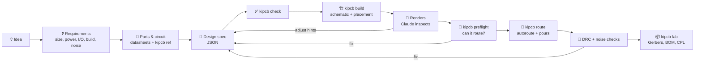

# How it works

`kipcb run` performs the whole right-hand side of this diagram in one command
(check, build, preflight, route, manufacturing files, report), so a design
iteration is a single step.

Claude does the engineering: requirements, part choice, circuit design,
review and judgement calls. The bundled `kipcb` tool does the mechanical
KiCad work. A single JSON **design spec** sits between them and is the source
of truth; everything else is generated from it.

## The design spec

A small JSON file with the parts (KiCad symbol, footprint, value, LCSC
number), the nets (`"VBUS": ["J1.VBUS", "U1.VI", "C1.1"]`), unused pins,
board size and rules, and optional placement hints. Full reference:
[spec-format.md](../skills/design/references/spec-format.md). Worked
examples: [`examples/`](../examples).

## Prebuilt blocks and parts

Most boards share the same building blocks: a USB-C input, a 3.3 V
regulator, an MCU with its reset and boot circuitry, LEDs, buttons, I²C. These
ship with the plugin as **blocks** (`kipcb blocks`): verified sub-circuits with
named ports. A design says `{"use": "esp32_c3_wroom02", "connect": {"IO4": "SDA"}}`
and gets the module, its decoupling, the EN and boot circuits and the buttons,
already wired to the reference design, with spare IOs marked unused. Individual
parts have short **part names** (`R0603`, `AMS1117-3.3`, `HEADER_1x04`) that fill
in symbol, footprint and, for common values, an LCSC number. Every block and part
is tested against KiCad's libraries before each release.

The part catalog carries JLCPCB part numbers for 265 resistor and capacitor
values (the JLCPCB basic library, which has no extra assembly fee; capacitors
get the highest voltage rating stocked) and for about 80 named parts. `kipcb
lcsc` checks live stock and searches JLCPCB's library, and exporting
manufacturing files warns about out-of-stock parts in the BOM.

Blocks can drop parts (`"omit": ["R1"]`, e.g. a bus terminator), and their
optional bus ports (USB, SWD, reset) join a net of the same name automatically,
so an `swd_header` block connects to an RP2040 or STM32 without wiring.

Parts from boards that reach "ready to order" are remembered locally, so they
become part names too.

## Validation (`kipcb check`)

- Every symbol and footprint is resolved against your installed KiCad libraries.
- Every `REF.PIN` reference is resolved against the real symbol. Pins can be
  referenced by number or by name, and a name connects every pin sharing it
  (e.g. all GND pins, or hidden stacked USB-C pins).
- Symbol pins are checked against footprint pads, and footprint choices
  against the symbol's footprint filters.
- **Every pin must be on a net or listed in `no_connect`**, so unused pins are
  a deliberate decision rather than an accident.
- Electrical sanity: single-pin nets, multiple drivers, undriven power inputs.
- **Logic levels**: chips on different supply voltages (say 3.3 V and 5 V) that drive the same signal are flagged.
- **Power budget**: with `current_ma` on the main loads, each rail's current is added up, and every linear regulator's heat, (Vin − Vout) × I, is compared with what its package can dissipate.

## Schematic generation

Symbols are grouped by function and packed onto the smallest sheet that
fits. Each connected pin gets a short wire stub ending in a net label or a
standard power symbol, and PWR_FLAGs are added where power enters from a
connector. The result is a clean, ERC-clean schematic that you can tidy by hand
without changing connectivity.

## Placement

1. Fixed parts, then edge parts. Connectors sit flush to their edge, with the
   mating side detected from the footprint and turned outward.
2. Decoupling capacitors (a `near` hint on a supply pin) go next, so they
   claim the spot beside their pin.
3. Everything else in connectivity order, each part placed where its pads are
   closest to connected pads, followed by refinement passes.

Auto-sized boards start from an estimate (part area, plus what has routed
before), then shrink step by step while every part still fits at full
spacing, never below the room needed for routing or a size that failed before.

Placement uses each footprint's real courtyard shape (a module's wide antenna
section doesn't block the pins beside it), spacing presets with extra
fan-out room around ICs, and `away_from` to separate noisy and sensitive parts.

## Placement spacing

On a board with spare room, kipcb widens the gaps between parts until the
layout covers about 45% of the board, instead of packing everything into one
corner, because crowded clusters are what fail to route. Parts pinned next to a pin
(decoupling and crystal capacitors) keep their tight spacing; fine-pitch
chips get the most extra room. Auto-sizing stops shrinking a board before it
gets denser than most real boards that routed completely at that layer count
(knowledge base).

## Preflight

Routing takes minutes; most reasons it fails can be seen in milliseconds on
the placed board. `kipcb preflight` (run automatically before routing) checks:

- **Pad reach**: the widest track that can reach a pad without breaking
  clearance to its neighbour follows from the pad pitch. A 0.25 mm track
  can't reach a 0.4 mm-pitch QFN pin at 0.2 mm clearance, so nets on
  fine-pitch chips automatically get a netclass with the track width and
  clearance real boards use at that pitch (from the knowledge base, e.g.
  0.2 mm / 0.15 mm at 0.4 mm pitch); preflight verifies every pad is reachable.
- **Netclasses**: each net has exactly one class (KiCad otherwise merges
  them, usually with the wrong width).
- **Manufacturer limits**: track, clearance, via, drill and edge clearance
  against the chosen manufacturer's standard capabilities.
- **Edge, overlaps, placement**: pads too near the edge, overlapping parts,
  parts off the board, decoupling and crystal parts too far from their pins.
- **Escape room**: sides of fine-pitch chips crowded by neighbours while
  several pins still have to route out that way.
- **Crowding**: one area packed far denser than the board as a whole.
- **Density**: connections per cm² compared with real routed boards and with
  how your own boards of similar density routed.

A failure stops the run before routing, with the fix.

## Routing

Freerouting autoroutes from a Specctra DSN export. Its runs are randomized and
behave in two ways: most finish a board completely within seconds, a few wander
for minutes and still leave connections. So kipcb runs short attempts (20 s
each, cycling through strategies), one at a time (two at once interfere and
both slow down), stops at the first complete route, lengthens the attempts
only if short ones keep failing, and gives up early when a whole round brings no
improvement. Each attempt is scored by KiCad's own connectivity check; a
completion pass then tries to finish anything left.

Fine-pitch chips get **fan-out** first, the way a person would start: a
bridge between neighbouring pins on the same net and a short locked stub from
every other used pin out past the pad row, so the router starts from easy
stub ends. The
early strategies keep signals off the bottom layer so it stays an unbroken
ground plane. Ground is then poured on both layers and stitched with vias.
Stacked duplicate pads (like USB-C's paired VBUS pins) are hidden from the
router so they don't cause failures, and the outline the router sees is
shrunk by the copper-to-edge rule so no track ends up too close to the edge.

## Checks

- **ERC / DRC** via KiCad, including schematic ↔ board parity.
- **Noise checks** (`kipcb noise`): decoupling distance per supply pin, ground
  plane coverage and fragmentation, signal length on the bottom layer, via
  stitching density, length, vias and edge clearance of noisy nets (clocks,
  switch nodes, PWM, USB), crosstalk between sensitive and noisy traces, crystal
  layout, switching-regulator loops, differential-pair matching and supply track
  width. Criteria are in
  [layout-guidelines.md](../skills/design/references/layout-guidelines.md).

## Learning

**From your own runs** (`kipcb learn`): each build and routing attempt is
appended to `~/.local/share/kipcb/experience.jsonl`. When routing a new
board, strategies are ranked by how they performed on past boards of similar
pad density (a contextual bandit with an exploration bonus). The first run on
a new kind of board uses the hand-tuned defaults; later runs start with what
worked. Auto-sized boards use the tightest area per pad that has reliably
routed, and footprints that caused unrouted connections get extra clearance.
Preflight results and each board's routing density are logged too, so the
density check learns how dense a board you can route at each layer count.
Runs that followed a broken placement (a part left off the board) are
ignored, so one bad run can't teach the wrong lesson. `kipcb learn reset`
clears everything, and `KIPCB_LEARN=0` turns logging off.

**From open-source designs** (`kipcb ref <part>`): the companion
[pcb-knowledge](https://github.com/virajrungta/pcb-knowledge) project mines
openly licensed KiCad projects on GitHub into statistics: how real designs
wire each chip's pins, layout distributions from hundreds of routed boards,
the track widths and clearances designers use at each pin pitch, and the
routing density real 2- and 4-layer boards reach. kipcb uses the pitch rules
when it sets up netclasses and the density figures in preflight. Only aggregate statistics are kept, with attribution. A copy ships
with the plugin, so `kipcb ref` works out of the box. Claude consults it during
part selection and review; the datasheet always wins.

Nothing is uploaded anywhere. Learning stays on your machine.

## Limits

Autorouted boards are functional, not optimal. Switching-regulator layout,
RF, controlled-impedance and high-speed signals (USB 480 Mb/s, Ethernet,
DDR) need human review or hand routing. The plugin flags these instead of
hiding them. Always review a design before ordering.
