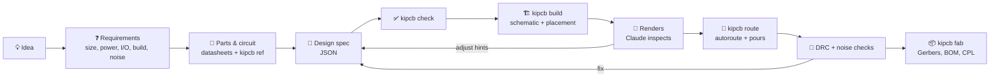

# How it works

`kipcb run` performs the whole right-hand side of this diagram in one command
(check, build, route, manufacturing files, report), so a design iteration is a
single step.

Claude does the engineering: requirements, part choice, circuit design,
review and judgement calls. The bundled `kipcb` tool does the mechanical
KiCad work. A single JSON **design spec** sits between them and is the source
of truth; everything else is generated from it.

## The design spec

A small JSON file with the parts (KiCad symbol, footprint, value, LCSC
number), the nets (`"VBUS": ["J1.VBUS", "U1.VI", "C1.1"]`), unused pins,
board size and rules, and optional placement hints. Full reference:
[spec-format.md](../skills/design/references/spec-format.md). Worked
examples: [`examples/`](../examples).

## Validation (`kipcb check`)

- Every symbol and footprint is resolved against your installed KiCad libraries.
- Every `REF.PIN` reference is resolved against the real symbol. Pins can be
  referenced by number or by name, and a name connects every pin sharing it
  (e.g. all GND pins, or hidden stacked USB-C pins).
- Symbol pins are checked against footprint pads, and footprint choices
  against the symbol's footprint filters.
- **Every pin must be on a net or listed in `no_connect`**, so unused pins are
  a deliberate decision rather than an accident.
- Electrical sanity: single-pin nets, multiple drivers, undriven power inputs.
- **Logic levels**: chips on different supply voltages (say 3.3 V and 5 V) that drive the same signal are flagged.
- **Power budget**: with `current_ma` on the main loads, each rail's current is added up, and every linear regulator's heat, (Vin − Vout) × I, is compared with what its package can dissipate.

## Schematic generation

Symbols are grouped by function and packed onto the smallest sheet that
fits. Each connected pin gets a short wire stub ending in a net label or a
standard power symbol, and PWR_FLAGs are added where power enters from a
connector. The result is a clean, ERC-clean schematic that you can tidy by hand
without changing connectivity.

## Placement

1. Fixed parts, then edge parts. Connectors sit flush to their edge, with the
   mating side detected from the footprint and turned outward.
2. Decoupling capacitors (a `near` hint on a supply pin) go next, so they
   claim the spot beside their pin.
3. Everything else in connectivity order, each part placed where its pads are
   closest to connected pads, followed by refinement passes.

Auto-sized boards start from an estimate (part area, plus what has routed
before), then shrink step by step while every part still fits at full
spacing, never below the room needed for routing or a size that failed before.

Placement uses each footprint's real courtyard shape (a module's wide antenna
section doesn't block the pins beside it), spacing presets with extra
fan-out room around ICs, and `away_from` to separate noisy and sensitive parts.

## Routing

Freerouting autoroutes from a Specctra DSN export. kipcb runs several
attempts with different strategies, scores each by KiCad's own connectivity
check and keeps the best, then runs a completion pass for anything left. The
early strategies keep signals off the bottom layer so it stays an unbroken
ground plane. Ground is then poured on both layers and stitched with vias.
Stacked duplicate pads (like USB-C's paired VBUS pins) are hidden from the
router so they don't cause failures.

## Checks

- **ERC / DRC** via KiCad, including schematic ↔ board parity.
- **Noise checks** (`kipcb noise`): decoupling distance per supply pin, ground
  plane coverage and fragmentation, signal length on the bottom layer, via
  stitching density, length, vias and edge clearance of noisy nets (clocks,
  switch nodes, PWM, USB), crosstalk between sensitive and noisy traces, crystal
  layout, switching-regulator loops, differential-pair matching and supply track
  width. Criteria are in
  [layout-guidelines.md](../skills/design/references/layout-guidelines.md).

## Learning

**From your own runs** (`kipcb learn`): each build and routing attempt is
appended to `~/.local/share/kipcb/experience.jsonl`. When routing a new
board, strategies are ranked by how they performed on past boards of similar
pad density (a contextual bandit with an exploration bonus). The first run on
a new kind of board uses the hand-tuned defaults; later runs start with what
worked. Auto-sized boards use the tightest area per pad that has reliably
routed, and footprints that caused unrouted connections get extra clearance.
Runs that followed a broken placement (a part left off the board) are
ignored, so one bad run can't teach the wrong lesson. `kipcb learn reset`
clears everything, and `KIPCB_LEARN=0` turns logging off.

**From open-source designs** (`kipcb ref <part>`): the companion
[pcb-knowledge](https://github.com/virajrungta/pcb-knowledge) project mines
openly licensed KiCad projects on GitHub into statistics: how real designs
wire each chip's pins, plus layout distributions from hundreds of routed
boards. Only aggregate statistics are kept, with attribution. A copy ships
with the plugin, so `kipcb ref` works out of the box. Claude consults it during
part selection and review; the datasheet always wins.

Nothing is uploaded anywhere. Learning stays on your machine.

## Limits

Autorouted boards are functional, not optimal. Switching-regulator layout,
RF, controlled-impedance and high-speed signals (USB 480 Mb/s, Ethernet,
DDR) need human review or hand routing. The plugin flags these instead of
hiding them. Always review a design before ordering.
